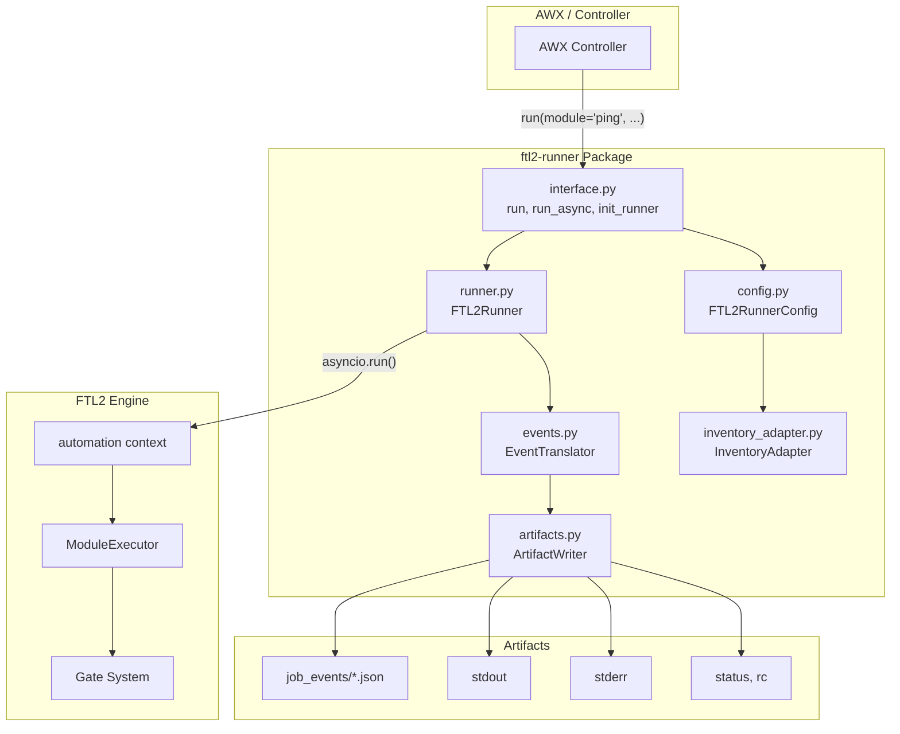
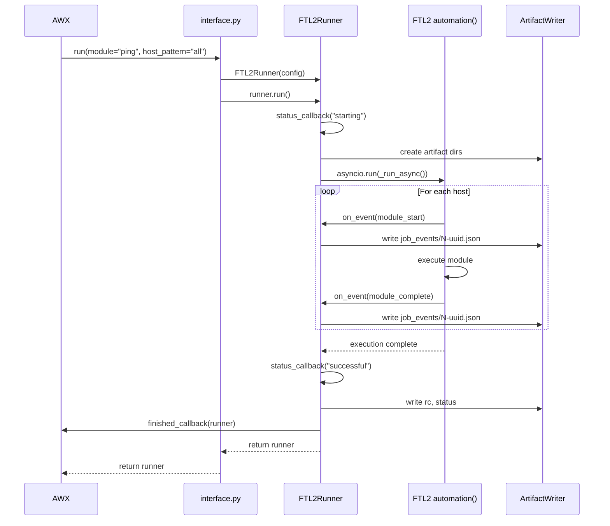

# FTL2-Runner: ansible-runner Compatibility Layer

A drop-in replacement for ansible-runner that uses FTL2 as the execution backend, enabling AWX to leverage FTL2's 3-17x performance improvement without code changes.

## Architecture



## Execution Flow



## Component Overview

### Package Structure

```
ftl2-runner/
├── pyproject.toml
├── README.md
├── docs/
│   ├── ftl2-runner-design.md
│   ├── architecture.png
│   └── execution-flow.png
└── src/
    └── ftl2_runner/
        ├── __init__.py
        ├── interface.py
        ├── runner.py
        ├── config.py
        ├── events.py
        ├── artifacts.py
        ├── inventory_adapter.py
        └── exceptions.py
```

### Interface Functions (`interface.py`)

Replicates ansible-runner's public API:

```python
def run(**kwargs) -> FTL2Runner:
    """Synchronous execution, returns Runner when complete."""

def run_async(**kwargs) -> tuple[threading.Thread, FTL2Runner]:
    """Async execution in thread, returns (thread, runner)."""

def init_runner(**kwargs) -> FTL2Runner:
    """Initialize without running."""
```

### FTL2RunnerConfig (`config.py`)

Translates ansible-runner parameters to FTL2 configuration:

| ansible-runner | FTL2 |
|---------------|------|
| `module` | Module name for execution |
| `module_args` | Parsed to dict for module call |
| `host_pattern` | Filter on FTL2 Inventory |
| `inventory` | FTL2 Inventory object |
| `limit` | Additional host filter |
| `forks` | Chunk size for parallel execution |
| `timeout` | FTL2 timeout |
| `verbosity` | `verbose=True` if > 0 |
| `envvars` | Environment for module execution |
| `extravars` | Merged into module_args |

### FTL2Runner (`runner.py`)

Compatible with ansible-runner's Runner class:

**Properties:**
- `status`: "unstarted" | "starting" | "running" | "successful" | "failed" | "timeout" | "canceled"
- `rc`: Return code (0 = success)
- `events`: Generator yielding event dicts from job_events/
- `stdout`: File handle to stdout artifact
- `stderr`: File handle to stderr artifact
- `stats`: Dict with ok/failed/changed counts per host
- `canceled`, `timed_out`, `errored`: Boolean flags

**Methods:**
- `run()`: Execute synchronously using `asyncio.run()`
- `host_events(host)`: Filter events by host

### EventTranslator (`events.py`)

Converts FTL2 events to ansible-runner format:

| FTL2 Event | ansible-runner Event |
|-----------|---------------------|
| `module_start` | `runner_on_start` |
| `module_complete` (success=True) | `runner_on_ok` |
| `module_complete` (success=False) | `runner_on_failed` |

**Event Structure:**
```json
{
    "event": "runner_on_ok",
    "uuid": "<uuid4>",
    "counter": 1,
    "created": "2026-02-09T10:00:00.000000",
    "runner_ident": "<ident>",
    "event_data": {
        "host": "localhost",
        "task": "ping",
        "task_action": "ping",
        "res": {"ping": "pong", "changed": false}
    }
}
```

### ArtifactWriter (`artifacts.py`)

Creates artifact directory structure AWX expects:

```
artifacts/<ident>/
├── job_events/
│   ├── 1-<uuid>.json
│   └── 2-<uuid>.json
├── stdout
├── stderr
├── rc
├── status
└── command
```

### InventoryAdapter (`inventory_adapter.py`)

Converts ansible-runner inventory formats to FTL2 Inventory:

- Path string → Load from file
- Dict → Convert to FTL2 Inventory
- INI string → Parse to Inventory
- Host list → Create simple inventory
- None → Use localhost

## Scope

### MVP: Ad-hoc Module Execution
- `run()`, `run_async()`, `init_runner()` functions
- `Runner` class with status, events, stdout/stderr
- Artifact directory structure
- Event translation

### Out of Scope (Future)
- Playbook execution (FTL2 executes modules directly)
- Roles and collections as first-class objects
- Process isolation / containerization
- Vault / encrypted variables
- Streaming pipeline (transmit/worker/process)

## Limitations

1. **No Playbook Support** - FTL2 executes modules directly, not YAML playbooks
2. **No Roles** - Roles require playbook context
3. **No Jinja2** - Variables passed directly, no templating
4. **No Process Isolation** - FTL2 uses SSH, not containers
5. **No Vault** - Encrypted variables not supported
6. **Simplified Host Patterns** - Basic glob matching only
