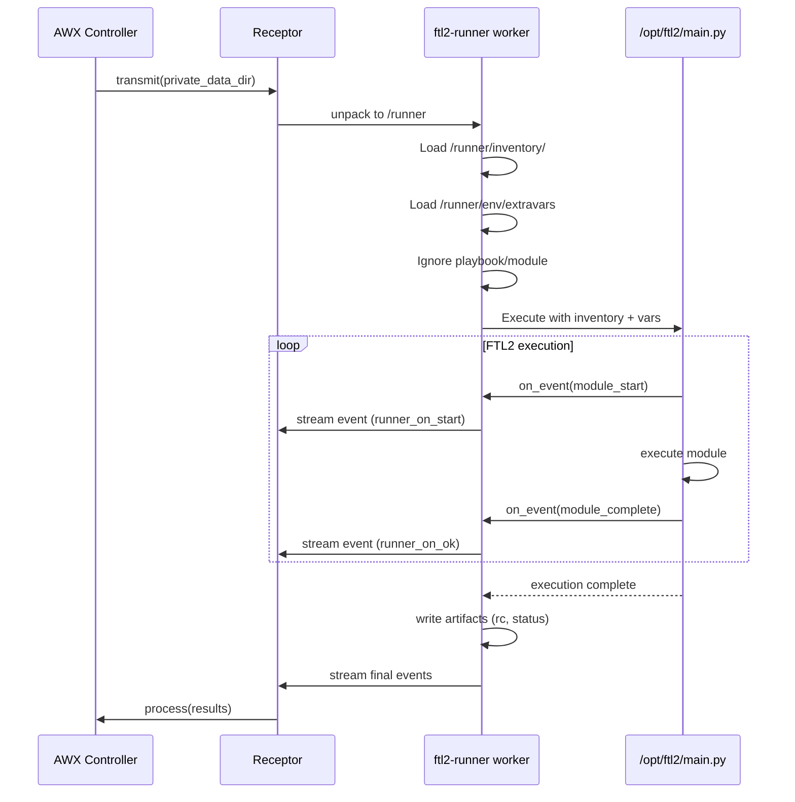

# FTL2-Runner: ansible-runner Compatibility Layer

A drop-in replacement for ansible-runner's worker mode that runs a baked-in FTL2 script inside AWX execution environments.

## Overview

Instead of translating ansible-runner API calls to FTL2, this package:

1. **Implements ansible-runner's worker CLI** - `ftl2-runner worker --private-data-dir=/runner`
2. **Ignores playbooks/tasks from AWX** - We don't execute what AWX sends
3. **Runs a baked-in FTL2 script** - Pre-built automation at `/opt/ftl2/main.py`
4. **Passes through inventory and extra_vars** - From AWX's private_data_dir
5. **Emits ansible-runner format events** - So AWX can track progress

## Architecture

```mermaid
graph TB
    subgraph "AWX Controller"
        AWX[AWX Controller]
        TX[Transmit Phase]
        PX[Process Phase]
    end

    subgraph "Receptor Network"
        RX[Receptor]
    end

    subgraph "Execution Environment Container"
        WK[ftl2-runner worker]

        subgraph "Private Data Dir /runner"
            INV[inventory/]
            ENV[env/extravars]
            PB[project/playbook.yml<br/>IGNORED]
        end

        subgraph "Baked-in Script"
            FTL[/opt/ftl2/main.py]
        end

        subgraph "FTL2 Engine"
            AUTO[automation context]
            EXEC[ModuleExecutor]
        end

        ART[artifacts/]
    end

    AWX --> TX
    TX -->|stream private_data_dir| RX
    RX -->|unpack| WK
    WK -->|read| INV
    WK -->|read| ENV
    WK -->|execute| FTL
    FTL --> AUTO
    AUTO --> EXEC
    EXEC -->|results| ART
    WK -->|stream events| RX
    RX --> PX
    PX --> AWX
```

## Execution Flow



## Package Structure

```
ftl2-runner/
├── pyproject.toml
├── README.md
├── docs/
│   └── ftl2-runner-design.md
└── src/
    └── ftl2_runner/
        ├── __init__.py           # Package exports
        ├── cli.py                # CLI entry point (worker command)
        ├── worker.py             # Worker implementation
        ├── events.py             # Event translation (FTL2 → ansible-runner)
        ├── artifacts.py          # Artifact directory management
        └── exceptions.py         # Exception classes
```

## CLI Interface

```bash
# Primary command - run as ansible-runner worker replacement
ftl2-runner worker --private-data-dir=/runner

# Options (compatible with ansible-runner worker)
ftl2-runner worker [--delete] --private-data-dir=PATH
```

## Worker Implementation

### Input (from AWX via private_data_dir)

```
/runner/
├── inventory/           # ← Pass to FTL2
│   └── hosts
├── env/
│   └── extravars       # ← Pass to FTL2 as variables
├── project/            # ← IGNORED
│   └── playbook.yml
└── artifacts/          # ← Write output here
```

### Processing

1. **Load inventory** from `/runner/inventory/` → FTL2 inventory
2. **Load extravars** from `/runner/env/extravars` (JSON) → FTL2 variables
3. **Ignore** playbook, module, module_args, etc.
4. **Execute** baked-in script at `/opt/ftl2/main.py`
5. **Stream events** in ansible-runner format to stdout
6. **Write artifacts** to `/runner/artifacts/`

### Baked-in Script Location

The FTL2 automation script is baked into the execution environment at:
```
/opt/ftl2/main.py
```

This script receives:
- `inventory`: Path to inventory directory
- `extravars`: Dict of extra variables from AWX

Example script structure:
```python
# /opt/ftl2/main.py
import asyncio
from ftl2 import automation

async def main(inventory_path: str, extravars: dict):
    async with automation(inventory=inventory_path) as ftl:
        # Your automation here
        await ftl.ping()

if __name__ == "__main__":
    # Called by ftl2-runner worker
    pass
```

## Event Translation

FTL2 events are translated to ansible-runner format for AWX compatibility:

| FTL2 Event | ansible-runner Event |
|-----------|---------------------|
| `module_start` | `runner_on_start` |
| `module_complete` (success) | `runner_on_ok` |
| `module_complete` (failed) | `runner_on_failed` |

### Event Structure

```json
{
    "event": "runner_on_ok",
    "uuid": "550e8400-e29b-41d4-a716-446655440000",
    "counter": 1,
    "created": "2026-02-09T10:00:00.000000+00:00",
    "runner_ident": "1",
    "event_data": {
        "host": "webserver01",
        "task": "file",
        "task_action": "file",
        "res": {
            "changed": true,
            "path": "/tmp/test"
        }
    }
}
```

## Artifact Output

```
/runner/artifacts/<ident>/
├── job_events/
│   ├── 1-<uuid>.json
│   ├── 2-<uuid>.json
│   └── ...
├── stdout
├── stderr
├── rc
└── status
```

## Execution Environment Setup

The execution environment container image must include:

1. **ftl2-runner package** - This package
2. **ftl2 package** - FTL2 automation framework
3. **Baked-in script** - `/opt/ftl2/main.py`
4. **Entry point** - `ftl2-runner worker`

Example Containerfile:
```dockerfile
FROM quay.io/ansible/ansible-runner:latest

# Install FTL2 and ftl2-runner
RUN pip install ftl2 ftl2-runner

# Copy baked-in automation script
COPY main.py /opt/ftl2/main.py

# Override entry point (or AWX will call ansible-runner worker)
# Note: AWX sends the command, so this may need receptor config instead
```

## What We Ignore from AWX

- `project/` directory (playbooks)
- `playbook` parameter
- `module` and `module_args` parameters
- `role` parameter
- Most env/ files except `extravars`

## What We Pass Through

- `inventory/` directory → FTL2 inventory
- `env/extravars` → FTL2 variables dict
- `ident` → Runner identifier for artifacts

## Limitations

1. **Fixed automation** - Same script runs every time (configurable via extravars)
2. **No playbook support** - Playbooks from AWX are ignored
3. **No ad-hoc commands** - Module/module_args ignored
4. **Inventory format** - Must be compatible with FTL2's inventory loader
