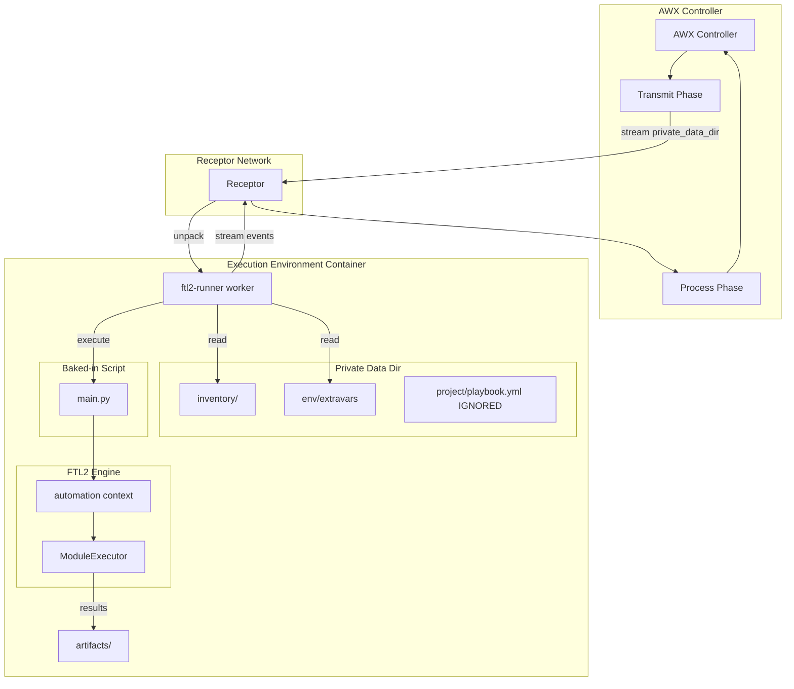
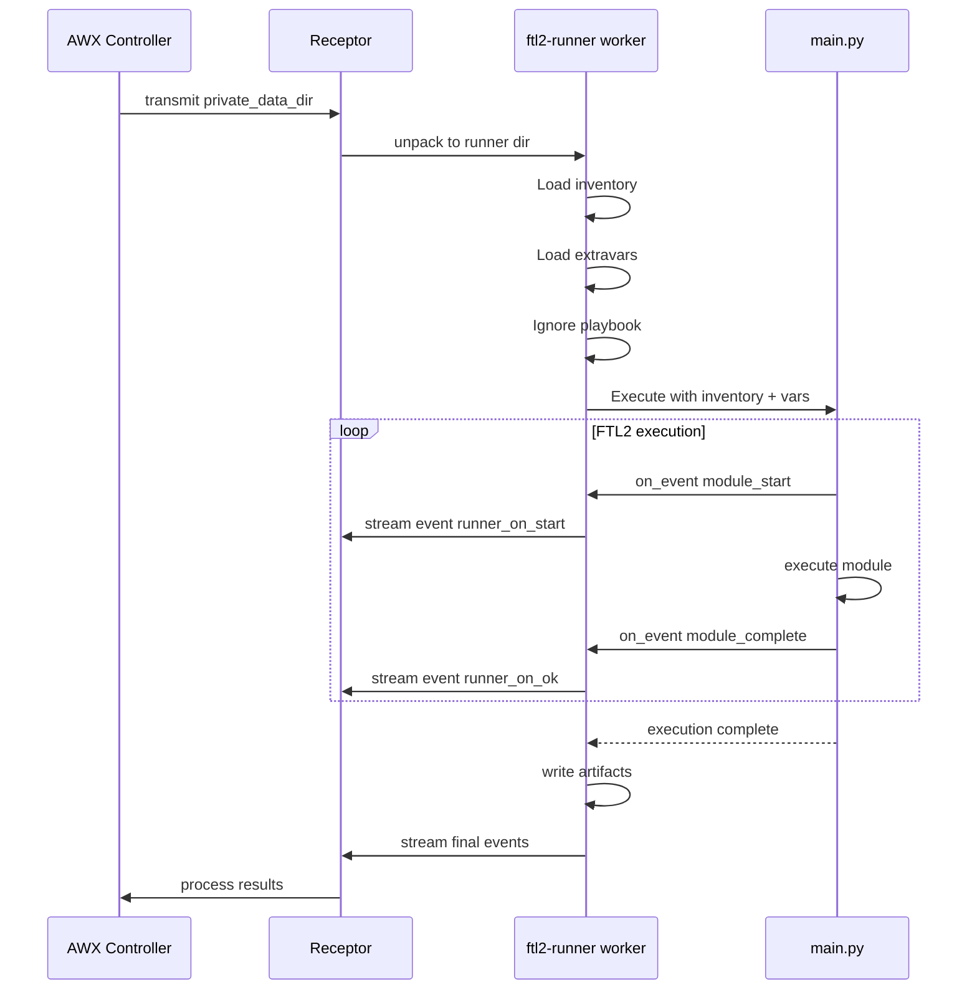

# FTL2-Runner: ansible-runner Compatibility Layer

A drop-in replacement for the `ansible-runner` binary that runs a baked-in FTL2 script inside AWX execution environments.

## Overview

Instead of translating ansible-runner API calls to FTL2, this package:

1. **Replaces the ansible-runner binary** - Symlink `ansible-runner` → `ftl2-runner`
2. **Implements the worker CLI** - `ansible-runner worker --private-data-dir=/runner`
3. **Ignores playbooks/tasks from AWX** - We don't execute what AWX sends
4. **Runs a baked-in FTL2 script** - Pre-built automation at `/opt/ftl2/main.py`
5. **Passes through inventory and extra_vars** - From AWX's private_data_dir
6. **Emits ansible-runner format events** - So AWX can track progress

## Architecture



## Execution Flow



## Package Structure

```
ftl2-runner/
├── pyproject.toml
├── README.md
├── docs/
│   └── ftl2-runner-design.md
└── src/
    └── ftl2_runner/
        ├── __init__.py           # Package exports
        ├── __main__.py           # CLI entry point
        ├── worker.py             # Worker implementation
        ├── streaming.py          # Stdin/stdout streaming (unpack/pack)
        ├── events.py             # Event translation (FTL2 → ansible-runner)
        └── capacity.py           # CPU/memory info for --worker-info
```

## CLI Interface

The CLI must be compatible with ansible-runner's interface since Receptor calls it directly.

```bash
# Primary command invoked by Receptor
ansible-runner worker --private-data-dir=/runner

# Full worker options
ansible-runner worker [OPTIONS]
  --private-data-dir PATH    Base directory for job data (required)
  --worker-info              Return CPU/memory/version JSON and exit
  --delete                   Delete private_data_dir before/after job
  --keepalive-seconds N      Send keepalive events at interval

# Worker subcommands
ansible-runner worker cleanup [OPTIONS]
  --file-pattern PATTERN     Glob pattern for directories to clean
  --remove-images            Also remove container images
  --grace-period SECONDS     Only clean items older than this
```

### --worker-info Response

AWX calls this for health checks. Must return YAML:

```yaml
{mem_in_bytes: 16000000000, cpu_count: 8, runner_version: '2.4.0', uuid: 'abc123'}
```

## Worker Implementation

### Streaming Protocol

1. **Receive data from stdin** - Receptor streams tar data from transmit phase
2. **Unpack to private_data_dir** - Extract inventory/, env/, project/, artifacts/
3. **Execute job** - Run baked-in FTL2 script
4. **Write events to stdout** - ansible-runner event JSON format
5. **Write artifacts** - job_events/*.json, stdout, stderr, rc, status

### Input Directory Structure

```
/runner/
├── inventory/           # ← Pass to FTL2
│   └── hosts
├── env/
│   ├── extravars       # ← Pass to FTL2 as variables (JSON)
│   ├── settings        # Runner settings (ignored)
│   └── ssh_key         # SSH key (ignored - FTL2 handles SSH)
├── project/            # ← IGNORED
│   └── playbook.yml
└── artifacts/          # ← Write output here
    └── <ident>/
```

### Processing Steps

1. Read streaming data from stdin (if no --private-data-dir exists)
2. Unpack tar to private_data_dir
3. Load `inventory/` directory path
4. Load `env/extravars` as JSON dict
5. Execute `/opt/ftl2/main.py` with inventory + extravars
6. Translate FTL2 events → ansible-runner format
7. Stream events to stdout
8. Write artifacts to `artifacts/<ident>/`
9. Clean up if --delete was specified

### Baked-in Script Interface

The FTL2 script at `/opt/ftl2/main.py` is called with:

```python
async def run(inventory_path: str, extravars: dict, on_event: Callable) -> int:
    """
    Args:
        inventory_path: Path to inventory directory
        extravars: Dict of extra variables from AWX
        on_event: Callback for FTL2 events

    Returns:
        Exit code (0 = success)
    """
```

Example implementation:

```python
# /opt/ftl2/main.py
import asyncio
from ftl2 import automation

async def run(inventory_path: str, extravars: dict, on_event) -> int:
    async with automation(inventory=inventory_path, on_event=on_event) as ftl:
        # Your automation here - extravars can control behavior
        target = extravars.get('target_hosts', 'all')
        await ftl.ping()
    return 0
```

## Event Translation

FTL2 events are translated to ansible-runner format:

| FTL2 Event | ansible-runner Event |
|-----------|---------------------|
| `module_start` | `runner_on_start` |
| `module_complete` (success) | `runner_on_ok` |
| `module_complete` (failed) | `runner_on_failed` |

### Event JSON Structure

```json
{
    "event": "runner_on_ok",
    "uuid": "550e8400-e29b-41d4-a716-446655440000",
    "counter": 1,
    "created": "2026-02-09T10:00:00.000000+00:00",
    "runner_ident": "1",
    "event_data": {
        "host": "webserver01",
        "task": "file",
        "task_action": "file",
        "res": {
            "changed": true,
            "path": "/tmp/test"
        }
    }
}
```

## Artifact Output

```
/runner/artifacts/<ident>/
├── job_events/
│   ├── 1-<uuid>.json
│   ├── 2-<uuid>.json
│   └── ...
├── stdout
├── stderr
├── rc
└── status
```

## Execution Environment Setup

```dockerfile
FROM quay.io/ansible/ansible-runner:latest

# Install FTL2 and ftl2-runner
RUN pip install ftl2 ftl2-runner

# Replace ansible-runner binary with ftl2-runner
RUN ln -sf $(which ftl2-runner) /usr/local/bin/ansible-runner

# Copy baked-in automation script
COPY main.py /opt/ftl2/main.py
```

## What We Handle

| Feature | Status |
|---------|--------|
| `worker --private-data-dir` | ✅ Implemented |
| `worker --worker-info` | ✅ Implemented |
| `worker --delete` | ✅ Implemented |
| `worker --keepalive-seconds` | ✅ Implemented |
| `worker cleanup` | ⚠️ Stub (returns success) |
| Streaming from stdin | ✅ Implemented |
| Event streaming to stdout | ✅ Implemented |
| Artifact writing | ✅ Implemented |

## What We Ignore

- `project/` directory (playbooks)
- `playbook`, `module`, `module_args` parameters
- `role` parameter
- Most `env/` files except `extravars`
- Container isolation options (FTL2 handles SSH directly)

## Limitations

1. **Fixed automation** - Same script runs every time (configurable via extravars)
2. **No playbook support** - Playbooks from AWX are ignored
3. **No ad-hoc commands** - Module/module_args ignored
4. **Inventory format** - Must be compatible with FTL2's inventory loader
